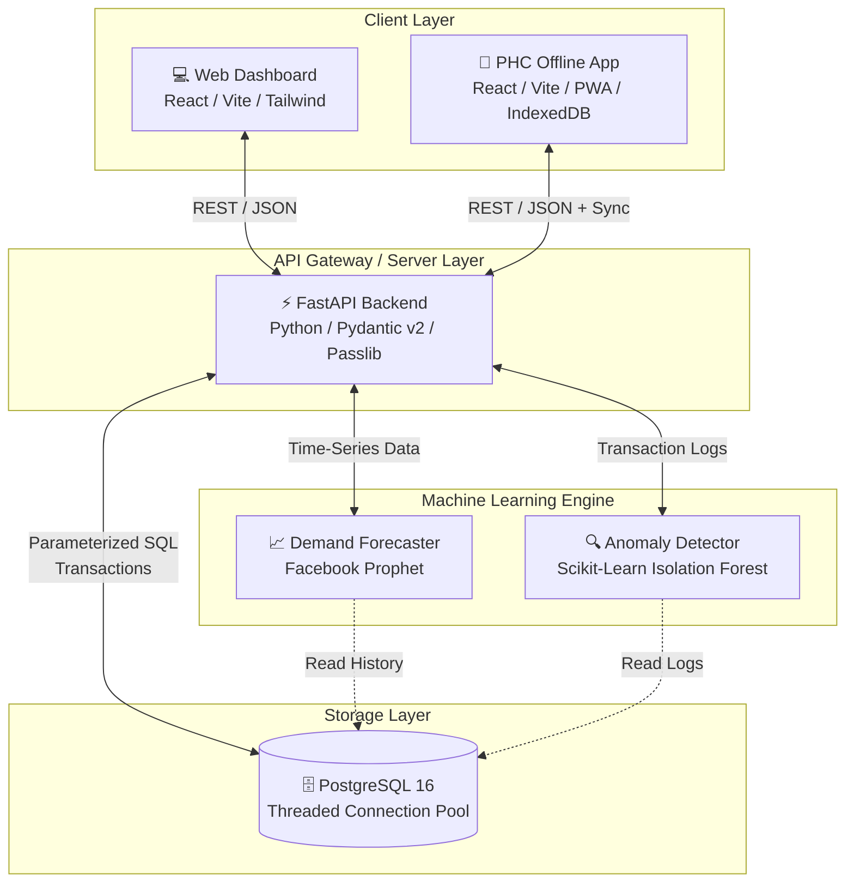

# 🏥 Smart Health — Healthcare Supply Chain & Prediction System

An enterprise-grade, full-stack healthcare supply chain management and demand forecasting platform designed for Primary Health Centres (PHCs) and Community Health Centres (CHCs).

---

## 🌟 Project Overview & Architecture

**Smart Health** tackles the critical challenge of medical supply shortages and inventory mismanagement across decentralized rural and urban healthcare facilities. The system combines real-time inventory tracking, offline-first mobile synchronization, and machine learning models to predict drug shortages and detect abnormal consumption patterns.

### 🏛️ System Architecture



---

## 🛠️ Technology Stack

| Component | Technology | Description |
| :--- | :--- | :--- |
| **Backend API** | Python 3.10+, FastAPI, Uvicorn | High-performance asynchronous REST API with automatic Swagger/OpenAPI documentation. |
| **Database** | PostgreSQL 16, psycopg2 | Relational database with threaded connection pooling, strict ACID transactions, and parameterized SQL. |
| **Machine Learning** | Facebook Prophet, Scikit-Learn, Pandas | Time-series forecasting for patient footfall and drug demand; Isolation Forest for usage anomaly detection. |
| **Web Dashboard** | React 19, Vite, Tailwind CSS v4, Recharts | Modern administrative web portal for inventory oversight, user management, and analytics. |
| **PHC Mobile App** | React 19, Vite, Tailwind CSS v4, PWA, IndexedDB | Offline-first Progressive Web App allowing rural health workers to log stock and attendance without internet. |

---

## 🔒 Security & Backend Refactoring Highlights

The backend has been completely refactored from an initial in-memory prototype into a hardened, production-ready PostgreSQL system:
1. **100% PostgreSQL Native**: All in-memory mock storage and fallback arrays have been eliminated.
2. **Zero SQL Injection Vulnerability**: Every database query uses parameterized SQL (`%s` placeholders). Raw string interpolation (`f-strings` or `.format()`) is prohibited.
3. **Transactional Integrity**: Multi-step operations (e.g., medicine catalog creation + inventory batch seeding, or stock updates + transaction logging) execute within atomic database transactions with automatic rollback on failure.
4. **Password Security**: User passwords are securely hashed using `passlib` (bcrypt) prior to database insertion. Password hashes are stripped from all API response models.
5. **Strict Input Validation**: Pydantic v2 validators enforce non-blank identifiers, email formatting, role whitelists, password strength, and non-negative inventory quantities.
6. **Timezone Standardization**: All timestamps utilize timezone-aware UTC (`datetime.now(timezone.utc)`), resolving Python 3.12 deprecation warnings.
7. **Connection Pool Lifecycle**: Database connections are managed via `psycopg2.pool.ThreadedConnectionPool` with automatic release and clean shutdown handling via FastAPI's `lifespan` hook.

---

## 📋 Prerequisites & System Setup

To run Smart Health locally or deploy it to a staging server, ensure the following prerequisites are installed on your machine:

### 1. Python 3.10 or Higher
- **Windows**: Download the installer from [python.org/downloads](https://www.python.org/downloads/).
  - **CRITICAL**: During installation, check the box **"Add Python to PATH"** before clicking Install.
- **Verification**: Open PowerShell or Command Prompt and run:
  ```powershell
  python --version
  pip --version
  ```

### 2. Node.js 18 or Higher
- **Windows**: Download the LTS installer from [nodejs.org](https://nodejs.org/).
- **Verification**: Open PowerShell or Command Prompt and run:
  ```powershell
  node --version
  npm --version
  ```

### 3. PostgreSQL 16
- **Option A: Docker Desktop (Recommended for Local Dev)**
  If you have Docker installed, start a local PostgreSQL container:
  ```powershell
  docker run --name smarthealth-postgres -e POSTGRES_USER=smarthealth -e POSTGRES_PASSWORD=smarthealth_dev -e POSTGRES_DB=smarthealth_db -p 5432:5432 -d postgres:16
  ```
- **Option B: Native Windows Installation**
  Download and install PostgreSQL from [postgresql.org/download/windows](https://www.postgresql.org/download/windows/). Create a user `smarthealth` and a database `smarthealth_db`.

---

## 🚀 Step-by-Step Execution Guide

Follow these exact steps in order to install dependencies, seed the database, and launch all three tiers of the application.

### Step 1: Database Schema & Seeding
1. Open PowerShell in the project root directory.
2. If using native PostgreSQL, ensure your database exists:
   ```powershell
   psql -U postgres -c "CREATE DATABASE smarthealth_db;"
   psql -U postgres -c "CREATE USER smarthealth WITH PASSWORD 'smarthealth_dev';"
   psql -U postgres -c "GRANT ALL PRIVILEGES ON DATABASE smarthealth_db TO smarthealth;"
   ```
3. Run the automated database schema and seeder:
   ```powershell
   python database/seed.py
   ```
   *Note: The seeder is idempotent and safe to re-run. It populates facilities (PHCs), medicines, initial inventory batches, 6 months of historical consumption data for ML forecasting, personnel, and daily attendance records.*

### Step 2: Backend API Setup & Launch
1. Navigate into the backend directory:
   ```powershell
   cd backend
   ```
2. Create your environment configuration file by copying the template:
   ```powershell
   Copy-Item .env.example .env
   ```
   *(Optional: Edit `.env` if your PostgreSQL credentials differ from the default).*
3. Install Python dependencies:
   ```powershell
   pip install -r requirements.txt
   ```
4. Start the FastAPI development server:
   ```powershell
   uvicorn main:app --reload --host 0.0.0.0 --port 8000
   ```
5. **Verify Backend**: Open your browser and navigate to [http://localhost:8000/docs](http://localhost:8000/docs) to access the interactive Swagger API documentation.

### Step 3: Web Dashboard Setup & Launch
1. Open a **new** PowerShell terminal and navigate to the frontend directory:
   ```powershell
   cd frontend
   ```
2. Install Node.js dependencies:
   ```powershell
   npm install
   ```
3. Start the Vite development server:
   ```powershell
   npm run dev
   ```
4. **Verify Dashboard**: Open your browser and navigate to [http://localhost:5173](http://localhost:5173). You can log in using the seeded admin credentials:
   - **Email**: `admin@smarthealth.local`
   - **Password**: `admin123`

### Step 4: PHC Offline Mobile PWA Setup & Launch
1. Open a **third** PowerShell terminal and navigate to the PHC app directory:
   ```powershell
   cd phc-app
   ```
2. Install Node.js dependencies:
   ```powershell
   npm install
   ```
3. Start the Vite development server:
   ```powershell
   npm run dev -- --port 5174
   ```
4. **Verify PWA**: Navigate to [http://localhost:5174](http://localhost:5174). This app simulates the offline-capable tablet/mobile interface used by rural health workers.

---

## 🔮 Production Deployment & Future Roadmap

To transition this project from local development to a live, production-grade online deployment, implement the following architectural enhancements:

### 1. Cloud Infrastructure & Containerization
- **Dockerization**: Create production `Dockerfile`s for the backend (using a multi-stage Python slim image) and frontends (building static HTML/JS/CSS served via Nginx).
- **Orchestration**: Deploy using **Docker Compose** on a single cloud VPS (AWS EC2, DigitalOcean, Hetzner) or via container platforms like **AWS ECS / EKS**, **Google Cloud Run**, or **Render / Railway**.
- **Managed Database**: Replace local PostgreSQL with a managed cloud database such as **AWS RDS for PostgreSQL**, **Google Cloud SQL**, or **Supabase / Neon**. This provides automated backups, point-in-time recovery, and read replicas.

### 2. Networking & Security Hardening
- **Reverse Proxy & SSL/TLS**: Place an **Nginx** or **Traefik** reverse proxy in front of all services. Terminate HTTPS using automated **Let's Encrypt / Certbot** SSL certificates.
- **CORS & Domain Restriction**: Update `CORS_ORIGINS` in `backend/.env` to strictly allow only your production frontend domain (e.g., `https://app.smarthealth.org`).
- **Authentication & Authorization**: Upgrade user authentication from basic password checks to stateless **JSON Web Tokens (JWT)** or **OAuth2 / OpenID Connect** (e.g., Auth0, Keycloak). Implement Role-Based Access Control (RBAC) middleware to isolate PHC data by district.

### 3. CI/CD & Automated Monitoring
- **CI/CD Pipelines**: Implement **GitHub Actions** workflows to automatically run linting (`oxlint`, `flake8`, `mypy`), unit tests (`pytest`), and build Docker images on every pull request.
- **Error Tracking & APM**: Integrate **Sentry** across the backend and React frontends for real-time exception logging and performance tracing.
- **Metrics & Alerting**: Expose Prometheus metrics (`/metrics`) from FastAPI and monitor system health via a **Grafana** dashboard. Set up automated Slack/Email alerts for database pool exhaustion or API latency spikes.

### 4. Advanced Machine Learning Evolution
- **Automated Model Retraining**: Set up a background **Celery / Redis** worker or AWS Lambda cron job to retrain the Facebook Prophet forecasting models weekly as new daily footfall and consumption data arrives.
- **Proactive Supply Notifications**: Integrate **Twilio SMS** or **WhatsApp Business API** to automatically notify district health officers and suppliers when the anomaly detector flags an unusual consumption spike (e.g., a localized disease outbreak) or when stock drops below critical thresholds.
